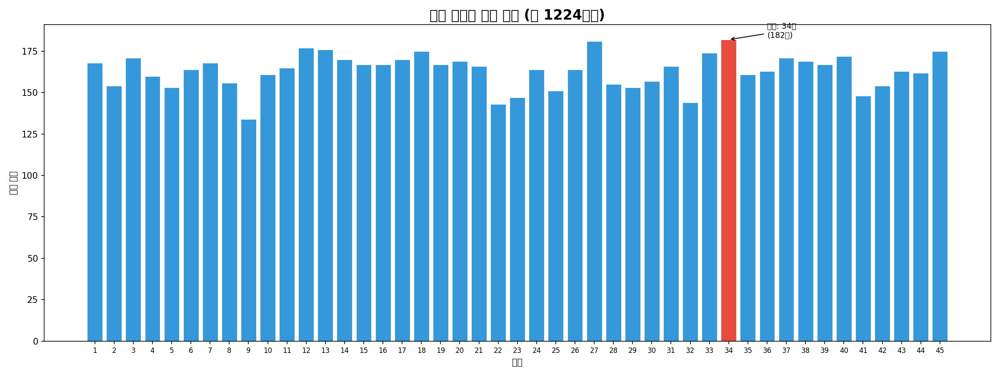
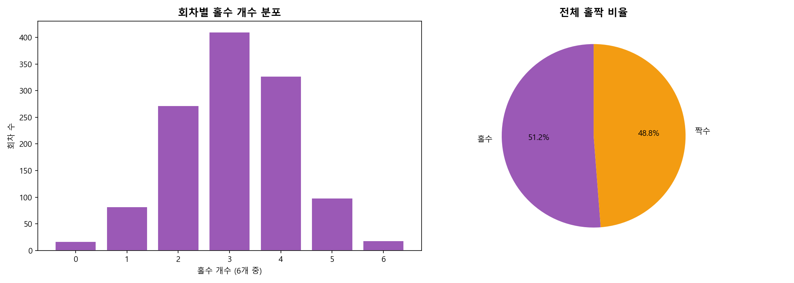
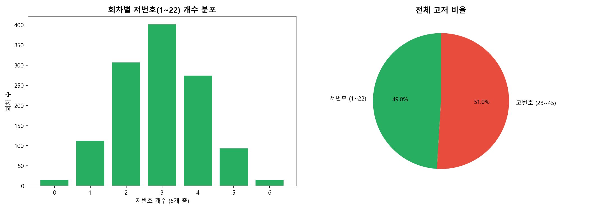
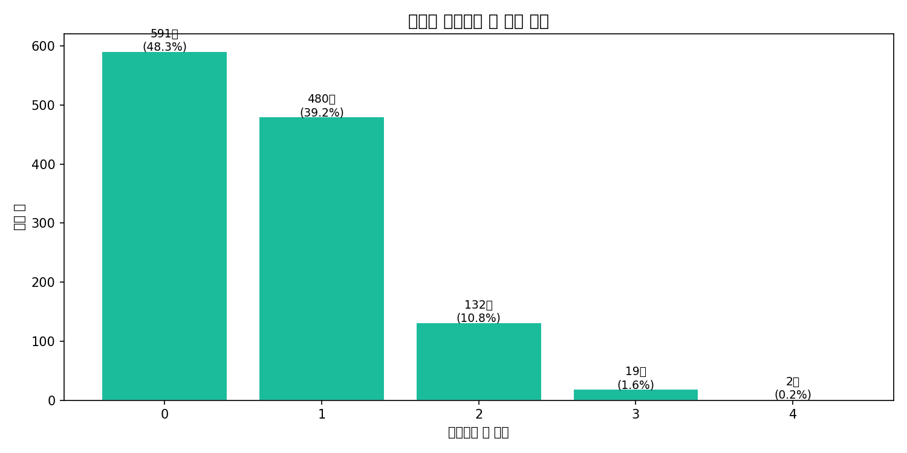
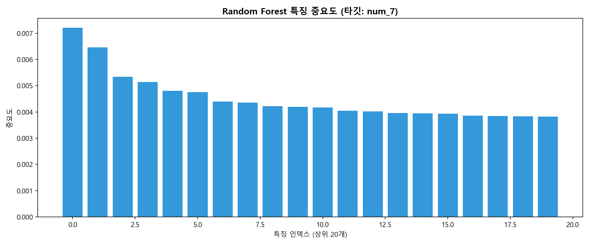
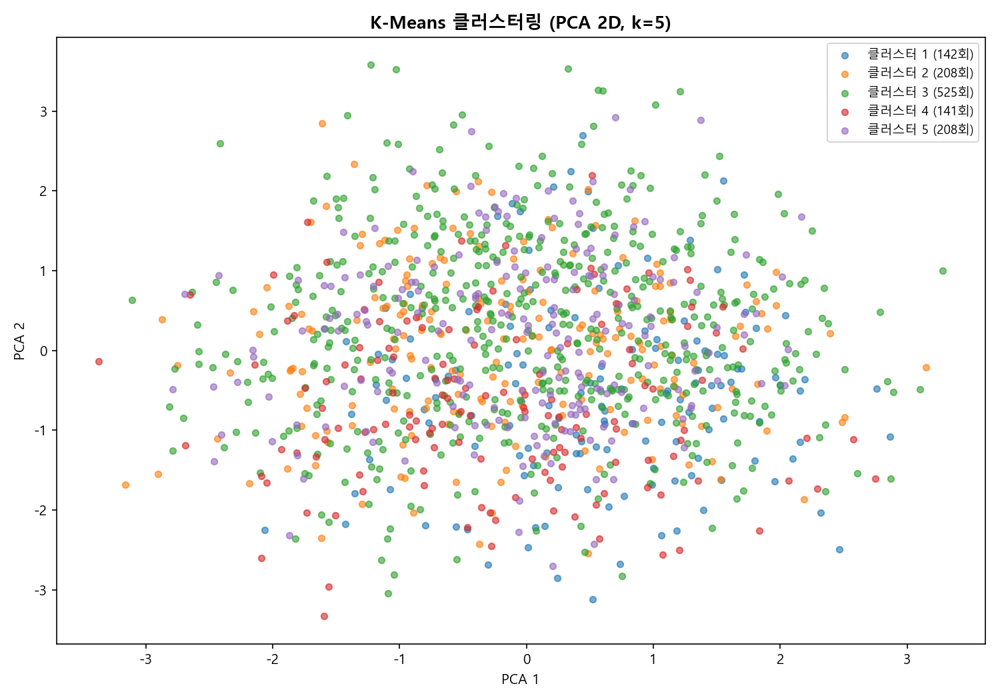
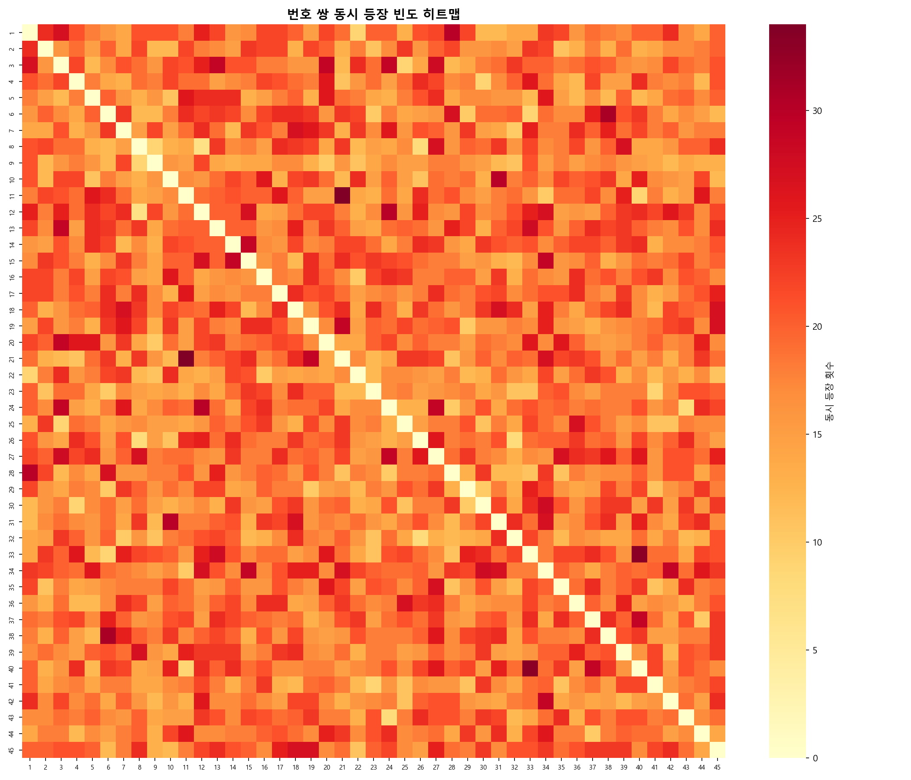
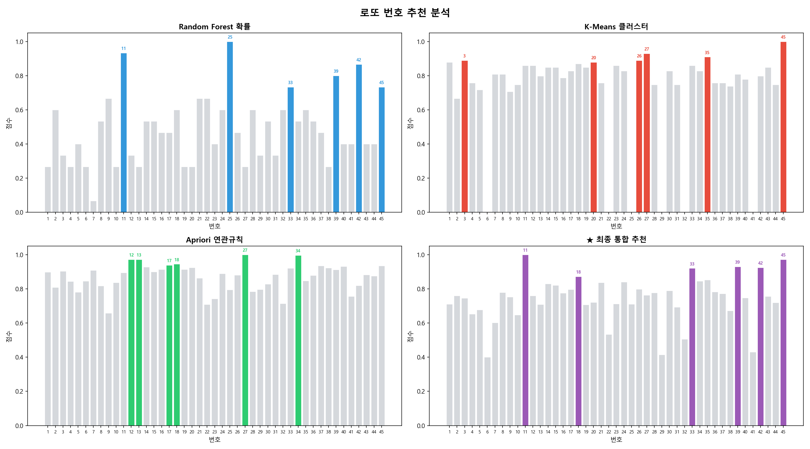

# 로또 번호 패턴 분석 프로젝트

> 1~1224회차(2002~2026) 전체 당첨 데이터를 기반으로 통계 분석과 머신러닝 모델을 적용한 데이터 사이언스 포트폴리오 프로젝트

---

## 목차

1. [프로젝트 소개](#프로젝트-소개)
2. [기술 스택](#기술-스택)
3. [프로젝트 구조](#프로젝트-구조)
4. [분석 결과](#분석-결과)
5. [ML 모델 결과](#ml-모델-결과)
6. [번호 추천 시스템](#번호-추천-시스템)
7. [실행 방법](#실행-방법)
8. [자동화 파이프라인](#자동화-파이프라인)
9. [결론](#결론)

---

## 프로젝트 소개

### 목적

**"로또 번호에 패턴이 있을까?"** 라는 질문에서 출발한 프로젝트입니다.

1회차(2002-12-07)부터 1224회차(2026-05-16)까지 **23년치 전체 당첨 데이터**를 수집·저장하고, 통계 분석과 3가지 머신러닝 모델(Random Forest, K-Means, Apriori)을 적용해 번호 출현 패턴을 탐색합니다. 최종적으로 모델 결합을 통한 번호 추천 시스템까지 구현했습니다.

### 핵심 기능

- 동행복권 공식 API + 엑셀 파일 기반 데이터 수집
- SQLite DB로 전체 회차 저장 및 관리
- 4가지 통계 분석 시각화
- Random Forest / K-Means / Apriori 머신러닝 분석
- GitHub Actions 기반 **매주 자동 업데이트**
- 세 모델 결합 번호 추천 시스템

---

## 기술 스택

| 분류 | 기술 |
|------|------|
| Language | Python 3.11 |
| Data | pandas, numpy, SQLite3 |
| Machine Learning | scikit-learn (Random Forest, K-Means, PCA), mlxtend (Apriori) |
| Visualization | matplotlib, seaborn |
| Automation | GitHub Actions (ubuntu-latest) |
| Data Source | 동행복권 공식 API, Excel |

---

## 프로젝트 구조

```
lotto_project/
├── data/
│   ├── lotto.xlsx          # 초기 전체 당첨 데이터 (1~1224회차)
│   └── lotto.db            # SQLite DB (자동 업데이트)
├── src/
│   ├── downloader.py       # 데이터 수집 (xlsx 로드 + API 신규 회차)
│   ├── database.py         # DB 저장·조회 (SQLite)
│   ├── analysis.py         # 통계 분석 및 시각화
│   └── models.py           # ML 모델 학습 및 번호 추천
├── outputs/
│   └── figures/            # 생성된 그래프 이미지
├── .github/
│   └── workflows/
│       └── update.yml      # GitHub Actions 자동화
├── main.py                 # CLI 진입점
└── requirements.txt
```

---

## 분석 결과

### 1. 번호별 출현 빈도



- 1~45번 모든 번호의 출현 횟수가 **130~182회**로 균등 분포
- **34번**이 182회로 최다 출현, **9번** 주변이 상대적으로 낮음
- 균등 분포는 로또 추첨의 공정성을 통계적으로 증명

### 2. 홀짝 비율



- 회차당 평균 홀수 **3.07개**, 짝수 **2.93개**
- 전체 홀짝 비율은 **51% : 49%** 로 거의 동일

### 3. 고저 비율 (1~22 저번호 / 23~45 고번호)



- 회차당 평균 저번호 **2.94개**, 고번호 **3.06개**
- 전체 고저 비율도 거의 **50% : 50%** 에 수렴

### 4. 연속번호 패턴



- 연속번호 쌍이 **1개 이상 포함된 회차 비율: 51.7%**
- 절반 이상의 회차에 연속번호가 존재 — 번호 선택 시 참고 가능

---

## ML 모델 결과

### Random Forest



- 최근 10회차의 번호 출현 이력을 특징으로, 다음 회차 45개 번호 각각의 출현 여부 예측
- **정확도 88.5%** (불균형 데이터 특성상 미출현 예측이 대부분)
- 특징 중요도(Feature Importance)로 최근 패턴에서 영향력 높은 번호 파악

### K-Means 클러스터링



- 전체 당첨 조합을 원-핫 인코딩 후 PCA 2차원 축소, 5개 클러스터로 분류
- 최근 20회차가 주로 속한 클러스터의 번호 빈도를 번호 추천에 활용

### Apriori 연관규칙 + 번호 쌍 히트맵



- 6개 번호 중 함께 등장하는 빈도가 높은 번호 쌍 탐색
- 모든 쌍의 support가 낮아 연관규칙보다 **빈발 아이템셋 누적 support**를 점수화해 활용

---

## 번호 추천 시스템



세 모델의 점수를 가중 합산해 최종 6개 번호를 추천합니다.

| 모델 | 가중치 | 추천 번호 |
|------|--------|----------|
| Random Forest | 40% | 11, 25, 33, 39, 42, 45 |
| K-Means | 30% | 3, 20, 26, 27, 35, 45 |
| Apriori | 30% | 12, 13, 17, 18, 27, 34 |
| **★ 최종 통합** | — | **11, 18, 33, 39, 42, 45** |

```bash
python main.py --recommend
```

---

## 실행 방법

### 환경 설정

```bash
git clone https://github.com/Shimyoungjong/lotto-pattern-analysis.git
cd lotto-pattern-analysis
pip install -r requirements.txt
```

### 명령어

```bash
# 1. 데이터 업데이트 (xlsx 초기 로드 + API 신규 회차 추가)
python main.py --download

# 2. DB 상태 확인
python main.py --info

# 3. 통계 분석 및 시각화
python main.py --analyze

# 4. ML 모델 학습
python main.py --train

# 5. 번호 추천
python main.py --recommend

# 6. 전체 파이프라인 한 번에 실행
python main.py --all
```

---

## 자동화 파이프라인

GitHub Actions를 통해 **매주 토요일 23:00 KST** 에 자동으로 실행됩니다.

```
[토요일 23:00 KST]
       ↓
  코드 체크아웃
       ↓
  패키지 설치 (ubuntu-latest)
       ↓
  python main.py --download   ← 신규 회차 API 수집
       ↓
  python main.py --analyze    ← 분석 그래프 재생성
       ↓
  git commit & push           ← DB + 그래프 자동 커밋
```

---

## 결론

### 로또는 통계적으로 랜덤이다

| 분석 항목 | 결과 | 해석 |
|----------|------|------|
| 번호별 출현 빈도 | 130~182회 (편차 ±4%) | 유의미한 편향 없음 |
| 홀짝 비율 | 51% : 49% | 거의 완벽한 균형 |
| 고저 비율 | 49% : 51% | 거의 완벽한 균형 |
| RF 정확도 88.5% | 대부분 "미출현" 예측 | 실질 예측력 없음 |
| Apriori 연관규칙 | 유의미한 규칙 0개 | 번호 간 연관성 없음 |

**1224회차 데이터를 분석한 결과, 로또 번호는 통계적으로 완전한 랜덤이며 어떤 모델도 실제 당첨 확률을 높일 수 없음을 확인했습니다.**

번호 추천 기능은 통계적 패턴 탐색 및 머신러닝 파이프라인 구현 시연을 목적으로 하며, 실제 당첨을 보장하지 않습니다.

---

> **데이터 출처**: [동행복권](https://www.dhlottery.co.kr) 공식 API 및 당첨 결과 데이터
